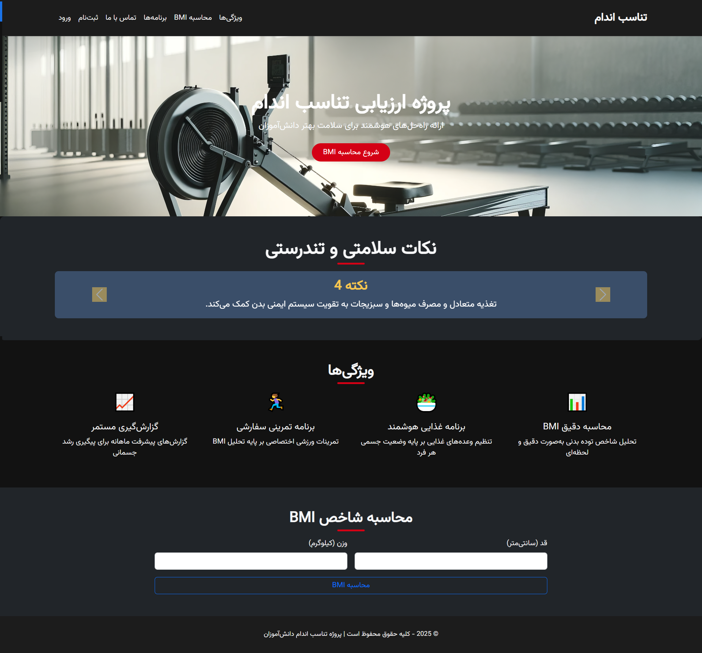

---




---

# 🏥 Health & Consultant Management System

یک سیستم حرفه‌ای برای مدیریت کاربران، محاسبه شاخص توده بدنی (BMI)، برنامه‌های سلامت، و داشبورد اختصاصی برای مشاورها!  

---

## 🚀 ویژگی‌ها
✅ ثبت‌نام و ورود کاربران  
✅ امکان ورود مشاورها با کد اختصاصی  
✅ محاسبه BMI و ذخیره تاریخچه  
✅ مشاهده پروفایل کاربری شامل تاریخچه BMI و برنامه‌های سلامتی  
✅ داشبورد مشاور برای مدیریت دانش‌آموزان و ارسال برنامه  
✅ قابلیت حذف رکوردهای BMI  
✅ احراز هویت کاربران و مشاورها  
✅ سیستم خروج امن  

---

## 💻 تکنولوژی‌ها
- **Django** (Web Framework)  
- **SQLite/PostgreSQL** (پایگاه‌داده)  
- **Bootstrap (اختیاری)** برای طراحی رابط کاربری  
- **Python**  

---

## 📝 نحوه اجرا
1️⃣ کلون کردن پروژه:
```bash
git clone https://github.com/your-username/health-consultant-app.git
cd health-consultant-app
